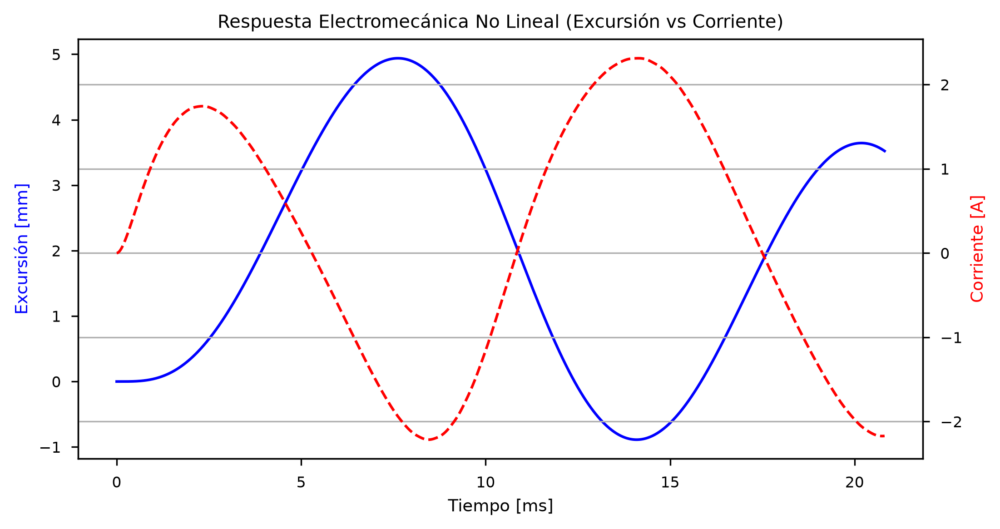
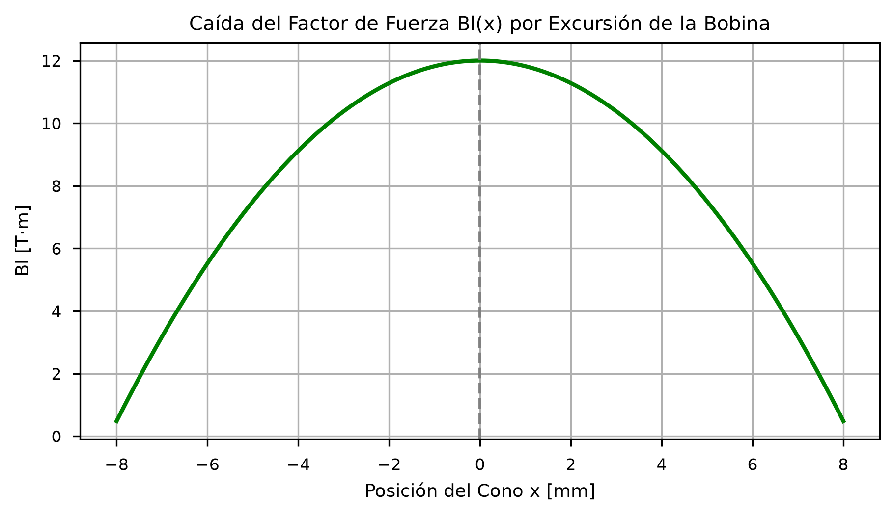

# Dossier Técnico: Modelado Numérico No Lineal de Transductores Electrodinámicos en Espacio de Estados

**Autor:** Marc Sánchez  
**Perfil:** Grado en Ingeniería de Tecnologías y Servicios de Telecomunicación — UPV  
**Contacto:** msanpra1@teleco.upv.es / sanchez17064@gmail.com | (https://github.com/Marcsanchezz) 

---

## 1. Resumen Ejecutivo
Los modelos lineales de parámetros Thiele-Small (TS) resultan insuficientes para predecir el comportamiento de transductores de alta excursión en regímenes de alta potencia. Este trabajo presenta un entorno de simulación numérica desarrollado en Python que resuelve las ecuaciones diferenciales acopladas de la bobina y la suspensión, contemplando la caída del factor de fuerza $Bl(x)$ y el incremento de la rigidez $K_{ms}(x)$ en función de la posición del cono.

---

## 2. Marco Físico-Matemático

El sistema electromecánico se define mediante dos ecuaciones diferenciales acopladas:

1. **Circuito Eléctrico (Bobina):**
   $$u(t) = R_e \cdot i(t) + L_e \frac{di(t)}{dt} + Bl(x) \cdot v(t)$$

2. **Dominio Mecánico (Masa-Muelle-Amortiguador):**
   $$Bl(x) \cdot i(t) = M_{ms} \frac{dv(t)}{dt} + R_{ms} \cdot v(t) + K_{ms}(x) \cdot x(t)$$

### Modificación por No-Linealidad
Se implementan modelos polinómicos para parametrizar la pérdida de simetría en el entrehierro y la tensión de la suspensión:
* **Factor de Fuerza:** $Bl(x) = Bl_0 \cdot (1 - \alpha \cdot x^2)$
* **Rigidez Dinámica:** $K_{ms}(x) = K_0 \cdot (1 + \beta \cdot x^2)$

---

## 3. Implementación en Espacio de Estados

Para la resolución en tiempo discreto, el sistema de 2º orden se transforma al formato matricial de **Espacio de Estados** con el vector de variables $\mathbf{y}(t) = [x(t), v(t), i(t)]^T$:

$$\begin{pmatrix} \dot{x} \\ \dot{v} \\ \dot{i} \end{pmatrix} = 
\begin{pmatrix} 
0 & 1 & 0 \\ 
-\frac{K_{ms}(x)}{M_{ms}} & -\frac{R_{ms}}{M_{ms}} & \frac{Bl(x)}{M_{ms}} \\ 
0 & -\frac{Bl(x)}{L_e} & -\frac{R_e}{L_e} 
\end{pmatrix} 
\begin{pmatrix} x \\ v \\ i \end{pmatrix} + 
\begin{pmatrix} 0 \\ 0 \\ \frac{1}{L_e} \end{pmatrix} u(t)$$

La integración numérica continua se realiza mediante el algoritmo de **Runge-Kutta de orden 4-5 (RK45)** a una frecuencia de muestreo de $48\text{ kHz}$.

---

## 4. Resultados de Simulación

### A. Excursión del Cono vs Corriente en la Bobina
Bajo excitaciones de $80\text{ Hz}$ a alta amplitud, se observa la saturación por desplazamiento físico ($x > \pm 3\text{ mm}$), generando un recorte simétrico de la forma de onda de la velocidad y compresión dinámica.

### B. Caracterización del entrehierro $Bl(x)$
Modelado de la pérdida del campo magnético efectivo cuando la bobina sale de la región lineal del imán.

---

## 5. Próximos Pasos y Líneas de Investigación

1. **Calibración Experimental (Hardware-in-the-Loop):** Extracción de parámetros reales de un recinto LD Systems ICOA 12 A mediante barridos de frecuencia (*sine sweeps*) capturados con micrófono de condensador RØDE NT1 e interfaz Focusrite.
2. **Portabilidad a Tiempo Real (C++ / JUCE):** Discretización mediante la Transformada Bilineal ($s \to z$) para la compilación de un plugin VST3 / motor DSP ejecutable con latencia ultrabaja.
3. **Predicción de Distorsión por Intermodulación (IMD):** Extensión del modelo para cuantificar la modulación cruzada entre bandas de subgrave y medios en motores coaxiales.